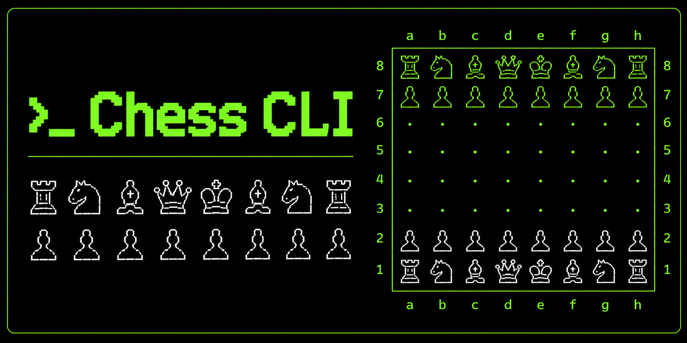

<div align="center">
  
  <p><em>shoutout to "image generator" by naif alotaibi on DALL·E for generating this image 🙏</em></p>
</div>

# Chess CLI

A command-line chess game written in C++20. Play chess directly in your terminal using standard algebraic notation.

## Building

```bash
make
./main
```

Requires a C++20-compatible compiler (g++ or clang++).

## How to Play

When prompted, enter moves using algebraic notation — column letter followed by rank number, space-separated:

```
Enter move in algebraic notation (e.g. e2 e4)
```

- You can only move pieces of your own color
- Illegal moves are rejected and you keep your turn

## C++20 Features

### `std::format`
Used throughout for string formatting instead of chained `<<` operators. The board printer uses the `{:^N}` centering specifier to align the turn label, and error messages interpolate the actual square coordinates so feedback is specific:

```cpp
std::cout << std::format("Illegal move: {}{} to {}{} is not a valid Knight move.\n",
    fromCol, fromRow, toCol, toRow);
```

### `constexpr` Coordinate Helpers
The algebraic-to-array-index conversions are defined once as `constexpr` functions, letting the compiler evaluate them at compile time when arguments are known:

```cpp
constexpr int colIndex(char col) { return tolower(col) - 'a'; }
constexpr int rowIndex(int row)  { return 8 - row; }
```

These replace duplicated inline arithmetic that was previously copy-pasted into both `get` and `set`.

## Polymorphic Structure

All pieces inherit from the abstract base class `Piece`:

```
Piece  (abstract)
├── Pawn
├── Knight
├── Rook
├── Bishop
├── Queen
└── King
```

`Piece` declares two pure virtual methods that every piece must implement:

```cpp
virtual bool move(ChessBoard&, char fromCol, int fromRow, char toCol, int toRow, Color) = 0;
virtual std::string getPieceIcon() const = 0;
```

The game loop holds a `Piece*` and calls `p->move(...)` — the correct piece logic is dispatched at runtime via vtable. This means adding a new piece type requires no changes to the game loop or `ChessBoard`; only a new class inheriting from `Piece` is needed.

Coordinates are passed as algebraic notation (`char col`, `int row`) all the way down the call stack. `ChessBoard::get` and `ChessBoard::set` are the only places that convert to internal array indices, keeping all other code free of index arithmetic.
